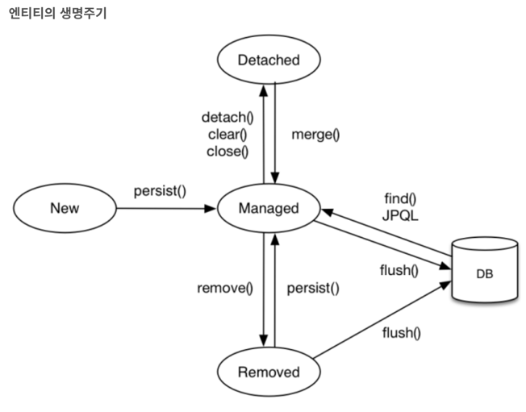
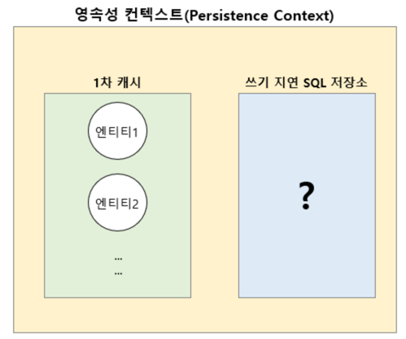

# 영속성 컨텍스트

> Entity 와 테이블이 매핑되는 정보를 캐싱

---

## 영속성

> 영속성이란? 영원히 계속되는 성질이나 능력

- 즉, DB와 엔티티간의 매핑되는 정보가 유지되는 것을 영속성이라 부를 수 있다.

### 영속성 상태

- 비영속성 (new / transient) : 영속성 컨텍스트와 관련이 없음 (일반적인 인스턴스)
- 영속 (managed) : 영속성 컨텍스트에서 관리되는 상태
- 준영속 (detached) : 영속성 컨텍스트에서 관리되다가, 제외된 상태
- 삭제 (removed) : 영속성 컨텍스트에서 삭제된 상태 
  

### 영속성 장점

- 캐싱을 하여 빠른 읽기 가능
- 같은 pk의 엔티티는 동일성 보장
- 캐싱데이터로 변경 감지

### 영속성 컨텍스트 구조 

### 영속성 컨텍스트 동작 구조

#### 1차 캐시

1. 등록
2. 조회
   1. 같은 데이터를 2번 조회한 경우 -> 같은 영속성 (같은 캐시 데이터를 바라본다)

#### 쓰기 지연

1. 트랜잭션이 commit 되는 순간 DB에 insert sql 을 요청한다
2. persist() 를 실행할 때 캐시와 쓰기지연에 같이 저장된다 (entity manager 기준)
3. data-jpa 에서는 save() 시 persist() 와 트랜잭션 commit이 발생된다.
4. flush 될 때 SQL 실행

#### 더티 체킹

1. 영속성 컨텍스트에서(1차 캐시) 관리되고 있는 엔티티에 대한 변경 (값 변경) 에 대한 내용을 트랜잭션 commit 시 스냅샷(2차 캐시)과 비교하여 변경 감지 후 update sql 요청
2. 더티 체킹된 update sql 도 쓰기 지연이 가능하다

#### 플러시 (flush)

- 트랜잭션 commit 발생시 flush가 함께 발생된다.
- flush 발생시 DB에 쓰기 지연에 저장된 SQL을 실행한다
- 영속성 컨텍스트의 변경 내용을 DB에 반영하는 용도

#### 플러시 하는 방법
- 엔티티 매니저 flush()
- 트랜잭션 commit()
- jpql 쿼리 실행 -> **플러시 자동 호출 -> 중요 -> 개중요** 

### JPQL 쿼리 실행시 플러시가 자동으로 호출되는 이유
- jpql 은 조회시에 만 사용 
- db에 커킷이 되어야 조회가 가능하기 때문
- 따로 설정할 수도 있으나 기본 설정 권장
